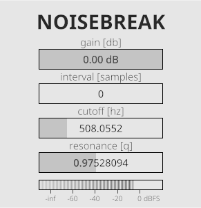

# N O I S E B R E A K
NOISEBREAK is the first audio plugin i've ever made. I did this to learn DSP and Rust. This is simply a white noise generator with an additional parameter: "interval"  
Interval is how many samples to wait before adding a new noise sample. Pure white noise would be made using a 0 interval. When you add to the interval you will get a bitcrushed/aliased noise. It literally breaks the noise apart, hence the plugin name.

This is pretty simple. It is addes as an effect and lets the original sound pass through, so you can used it for ambient.

For a example, check example.mp3.

# Technical info
This plugin was made using Rust and [nih-plug](https://github.com/robbert-vdh/nih-plug), which is an awesome library to make plugins. Specifically, this uses Iced.  
Keep in mind, I'm really new to Rust, so I might have used a bad aproach for multithreading.

# License
This uses the GPL v3 license to allow me to publish this. If anyone notices any licensing issues I'd need to fix I would deeply appreciate it if you warned me.

